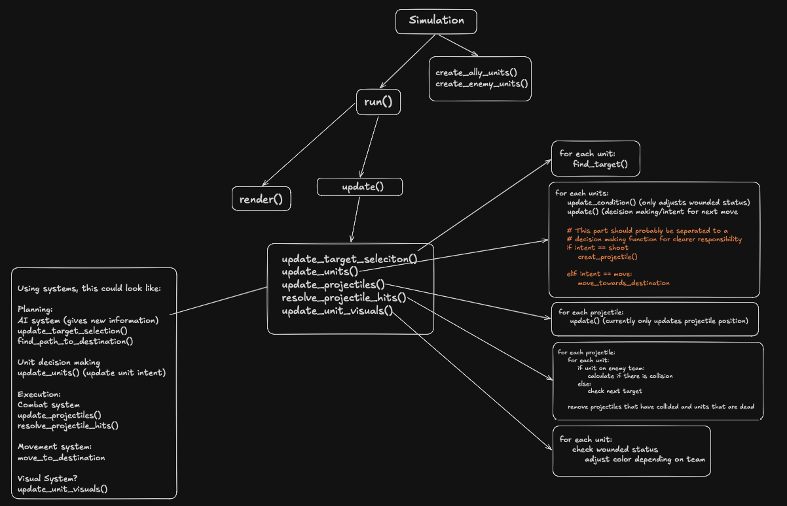

## Gameplay
- Pause simulation
- Variable simulation speed (0.5x, 2x, 4x)

## UI
- (FPS counter)
- (Selected unit information)
- (Toggle grid)
- Camera zoom

## AI
- Retreat behavior
- Suppression
- (Flanking)

## Optimizations
- Implement hidden grid system so projectiles can check all units in close proximity rather than every unit on the map.

## Random

## Workspace (thinking about ideas)

### Current structure

### Camera/scale
Ideally I want a simulation where you can zoom the camera, which means the scale has to be dependant of the camera zoom. If I have a constant such as `PIXELS_PER_METER`, I can use that to keep movement constant even though I might be zoomed in or out. How would this work:

1. The unit position stored in `unit.x` and `unit.y` is absolute and is simply the "real world position" regardless of camera zoom/scale. It could for example be `unit.x = 1253`, `unit.y = 217` --> `unit.position = (1253,217)`
2. The renderer then has to scale this down to whatever screen size/zoom I'm currently using, which is where `PIXELS_PER_METER` comes in. Say we have `PIXELS_PER_METER = 4`, this means the unit position above would be rendered on:
`rendered_unit_position = (round(unit.x * PIXELS_PER_METER), round(unit.y * PIXELS_PER_METER)) = (313,54)`
3. If my camera is zoomed in, there needs to be some type of conversion such that 2x zoom --> units take up 2x as much space on screen. Say I have a variable called `camera_zoom`. If `camera_zoom = 2` means the size in the `render()` function has to take in `camera_zoom` as an argument, and the size of the unit would be `(INFANTRY_UNIT_SIZE * camera_zoom)` or something along those lines. This way, camera zoom on 1 keeps units a certain size, and zooming in increases the unit size proportional to the zoom. 

The only thing I'm unsure of how to decide which part of the screen would be displayed when you zoom in. I feel like with this implementation, zooming would just increase the size of everything to the point where things might just overlap instead. I would need to zoom in on a subset of the total "war field" but how would I decide that? I if I use mouse scrolling, the cursor would be a center point, around which I can select a portion of the current screen to display on the full screen.

### Movement system
In order to allow a destination point, I first of all have to create fields for destination coordinates, and maybe some getters/setters to update it since it likely won't be static. Then it's a matter of moving towards that destination, which I feel will be some sort of delta coordinate using the difference between where the unit currently is and where it's going. I'm thinking:

**Example**
<pre>
unit.position(x1,y1)
unit.destination(x2,y2)
speed = k

coordinate_diff = destination - position = (x2 - x2, y2 - y1)
</pre>

The simplest way for a unit to move between two point would be the shortest distance, i.e. following the diagonal line which could be seen as the vector (dx,dy) where dy, dx is the difference in x and y coordinates respectively. Calculating the normalised vector would give the ratio between x and y speed, which could then be multiplied by whatever speed the unit has i.e the velocity to move towards the point would be:

k * ṽ, where ṽ = (vx,vy) is the normalised vector found by dividing each component by the length of the vector i.e ($\frac{v1}{|v|}$,$\frac{v2}{|v|}$). Using k = 1, ṽ = (4/5, 3/5)

k * ṽ = 1 * (4/5,3/5) = (4/5, 3/5) --> vx = 4/5, vy = 3/5

Since there are currently no obstacles, there isn't really a way to create a pathfinding algorithm. Instead, using the calculation above, the unit will simply move along the diagonal line as shown below:

I also need a conditional to check if the unit is close enough/on the destination point. In other words, if the distance to the point is less than the distance of the next movement, the unit should be placed on it's destination. Otherwise it will overshoot and rock back and forth. So I need a:

if movement_diff.length  > coordinate_diff.length:
    self.position = self.destination

### Combat System
The very basics of a combat system would include the following in roughly this order of implementation:

1. Collision detection (since that is what ultimately decides is someone/something is hit or not)
2. Health mechanic (decides if unit lives or dies)
3. Projectiles (what the infantry units will shoot)
4. Target selection (probably just closest enemy unit to start with)

### Collision detection
I would likely use something similar to the unit movement coordinate_diff system, except the coordinate_diff is between the two entities such as unit/unit or projectile/unit. Using pseudocode we would get something like:

<pre>
if entity_in_range:
    unit.is_hit()
</pre>

<pre>
def calculate_collisions(self):
    for i in range(len(units)):
        for j in range(len(units)):
            check(units[i], units[j])

coordinate_diff would be the difference between the current unit position and the position of the unit currently being checked against.

This would then update for every entity each tick of the simulation. This implementation, which basically checks EVERY entity against EVERY other entity, feels like it would be a performance nightmare though since there are nested for loops. I could probaly limit the search to only look at enemies inside a certain range of the unit, but don't know how to implement it.

**ChatGPT Extra Info** Any ideas? Also, what even is the best way to detect collisions? I'm sure Pygame has some built in function, but ideally I want to be as independant from pygame as possible. How could that work?

#### Unit detection
I'm thinking something along these lines:

<pre>
update()
    if target:
        unit.shoot(target)
    else:
        unit.move_toward_destination()
</pre>

<pre>
def enemy_in_range(self):
    enemy_in_range = False

    for enemy in enemies():
        difference = enemy.position.subtract(self.position)
        if difference.length <= self.range:
            enemy_in_range = True 
    
    return enemy_in_range
</pre>

<pre>
def shoot(enemy_position):
    bullet = simulation.create_projectile(unit.position)
    bullet.move_toward(enemy_position)
</pre>

<pre>
def move_toward_destination(self):
        coordinate_diff = self.destination.subtract(self.position)
        normalized = coordinate_diff.normalize()
        unit_velocity = normalized.scalar_multiplication(self.speed)
        next_movement = unit_velocity.scalar_multiplication(dt)

        if next_movement.length()  > coordinate_diff.length():
            self.position = self.destination
        else:
            self.position = self.position.add(next_movement)
</pre>

### Basic unit AI
I will need some type of state field for each unit, where the basic version would be similar to my current intent solution whereby each update units decide if they should walk or shoot. I would also benefit from implementing memory so units don't have to update movement every single frame.

simulation.update():

    simulation.observe() -->
    --> for each unit in units: 
            unit.state = "something" (depending on conditionals)

    switch (state):
        ADVANCE
            unit.intent = "move"
            unit.destination = some_predefined_advancement_destination
        HOLD
            unit.destination = unit.position
            if enemy in range and remaining_reload_duration == 0:
                unit.intent = "shoot"
            else:
                unit.intent = "move"
                unit.destination = some_predefined_advancement_destination
        RETREAT
            unit.intent = "move"
            unit.destnation = some_predefined_retreat_position

    simulation.execute_unit_intent()
    --> for each unit in units:
        switch(intent)
            move
                unit.move_toward_destination()
            shoot
                create_new_projectile()
            normal
                pass
        